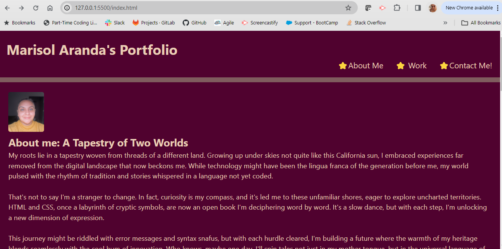
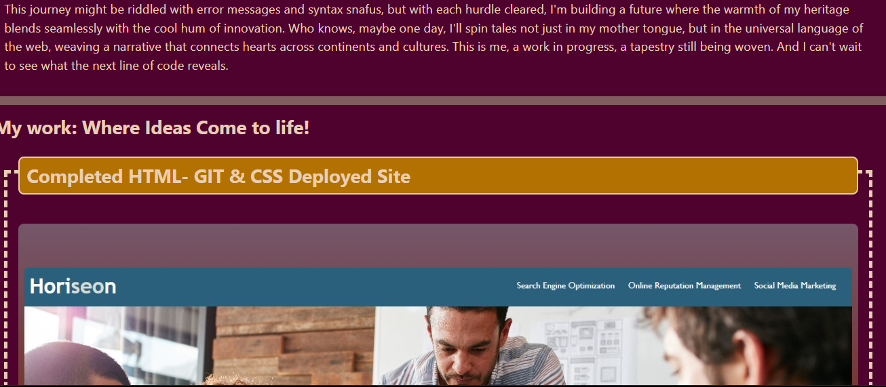
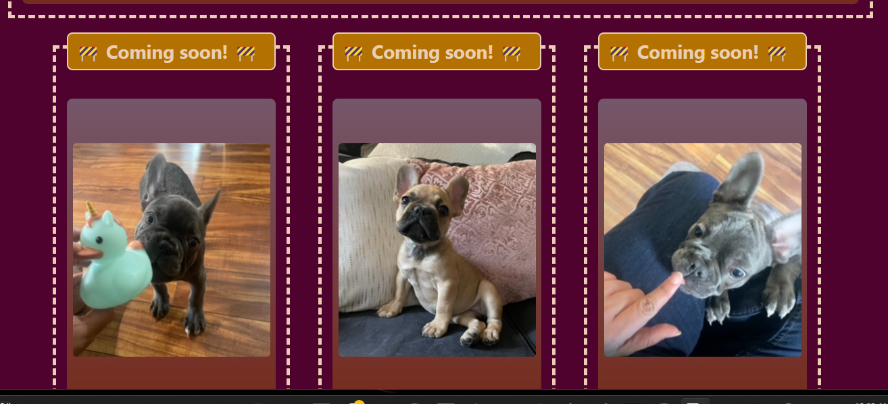
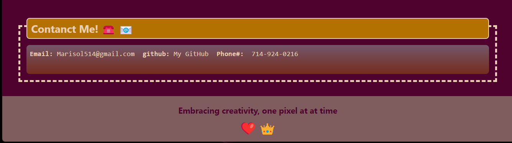

# My-Starter-Portfolio

## My Task
This week, I started bukding my profile and will be adding as the course progresses.

This portfolio of work will showcase my skills and talents to employers looking to fill position within their organizaton. My portfolio will show  deployed web applications.

## User Story

AS AN employer
I WANT to view a potential employee's deployed portfolio of work samples
SO THAT I can review samples of their work and assess whether they're a good candidate for an open position

## Acceptance Criteria
Here are the critical requirements necessary to develop a portfolio that satisfies a typical hiring manager’s needs:

GIVEN I need to sample a potential employee's previous work
WHEN I load their portfolio
THEN I am presented with the developer's name, a recent photo or avatar, and links to sections about them, their work, and how to contact them
WHEN I click one of the links in the navigation
THEN the UI scrolls to the corresponding section
WHEN I click on the link to the section about their work
THEN the UI scrolls to a section with titled images of the developer's applications
WHEN I am presented with the developer's first application
THEN that application's image should be larger in size than the others
WHEN I click on the images of the applications
THEN I am taken to that deployed application
WHEN I resize the page or view the site on various screens and devices
THEN I am presented with a responsive layout that adapts to my viewport

## Scren Shots

## Review Links
Deplyes Application Link: https://marisol514.github.io/My-Starter-Portfolio/

URL GitHub Repository: https://github.com/Marisol514/My-Starter-Portfolio

## Acknowledgments:

Worked with Danniel Merino mostly to bouce ideas.

## Resources: 

Accesibility - Contrast Checker: https://accessibleweb.com/color-contrast-checker/
emoji source: https://emojipedia.org/

Mini-Project references: https://git.bootcampcontent.com/University-of-California---Irvine/UCI-VIRT-FSF-PT-12-2023-U-LOLC/-/tree/main/02-Advanced-CSS/01-Activities/28-Stu_Mini-Project?ref_type=heads

Links References: https://git.bootcampcontent.com/University-of-California---Irvine/UCI-VIRT-FSF-PT-12-2023-U-LOLC/-/tree/main/01-HTML-Git-CSS/01-Activities/06-Stu_HTML?ref_type=heads

Reset Reference: https://dev.to/ziratsu/css-reset-58h9
http://web.simmons.edu/~grovesd/comm244/notes/week4/css-reset

Roor: https://developer.mozilla.org/en-US/docs/Web/CSS/:root

Flex: https://developer.mozilla.org/en-US/docs/Web/CSS/flex

Flex Direction: https://developer.mozilla.org/en-US/docs/Web/CSS/flex-direction

CSS Variables: https://developer.mozilla.org/en-US/docs/Web/CSS/Using_CSS_custom_properties

Justify Content: https://developer.mozilla.org/en-US/docs/Web/CSS/justify-content

Outline: https://developer.mozilla.org/en-US/docs/Web/CSS/outline

Outline Offset: https://developer.mozilla.org/en-US/docs/Web/CSS/outline-offset

:hover: https://developer.mozilla.org/en-US/docs/Web/CSS/:hover

White-Space: https://developer.mozilla.org/en-US/docs/Web/CSS/white-space

Vertical Align: https://developer.mozilla.org/en-US/docs/Web/CSS/vertical-align

@media: https://developer.mozilla.org/en-US/docs/Web/CSS/@media
 

